# Transsion Addons

Transsion Addons is an Android tuning utility for rooted Transsion-family devices and compatible Android devices. It exposes display, kernel, thermal, game space, LED, overlay monitor, charging, and devfreq controls from one lightweight app.

Created by **Sparxiee22**.

## Features

- Display refresh, resolution, debug and renderer controls
- CPU/GPU governor and frequency controls
- Kernel settings for I/O, memory, scheduler, networking and misc nodes
- Thermal monitor and thermal throttling toggle
- Game Space compatibility and runtime controls
- LED backlight controls when the kernel exposes LED nodes
- Floating overlay monitor for FPS, CPU/GPU, RAM, temperatures and battery

## Screenshots

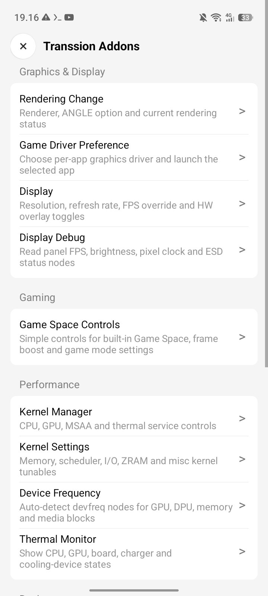

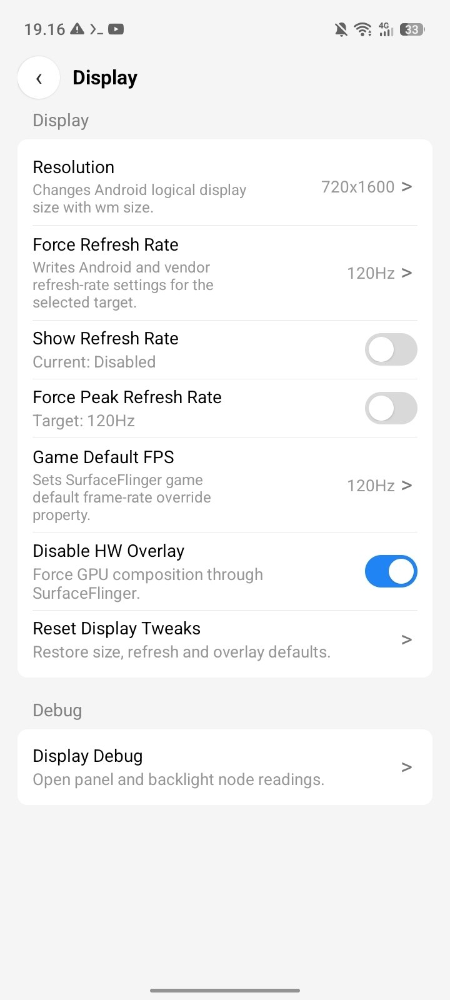
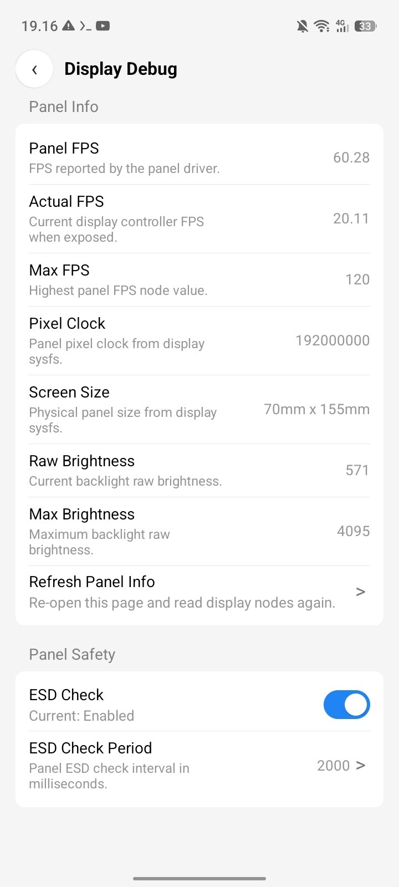
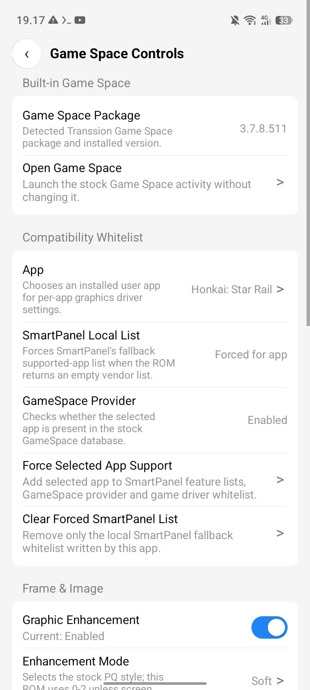
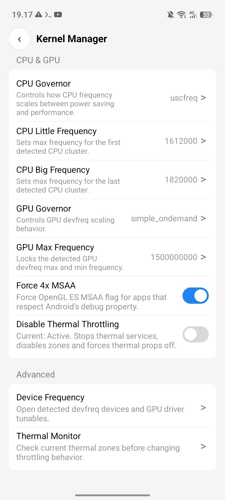
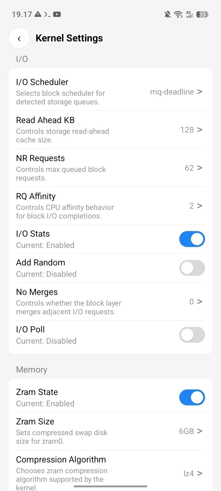
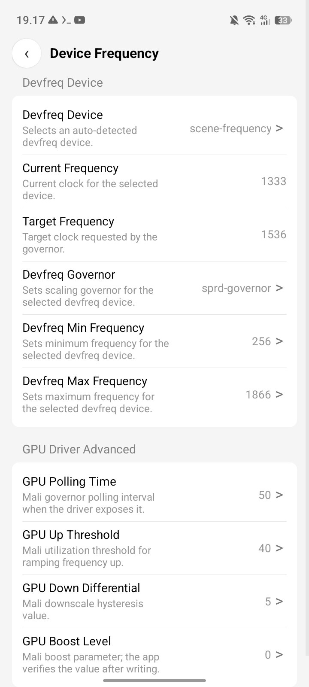
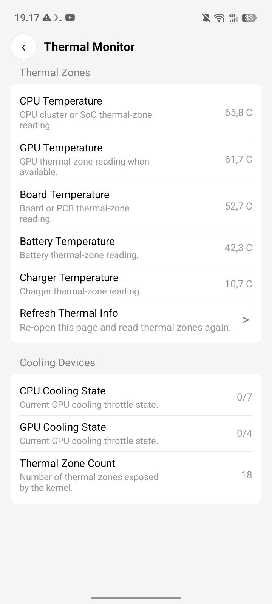
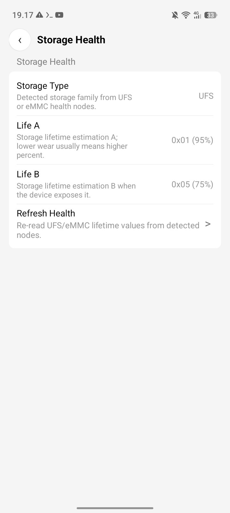
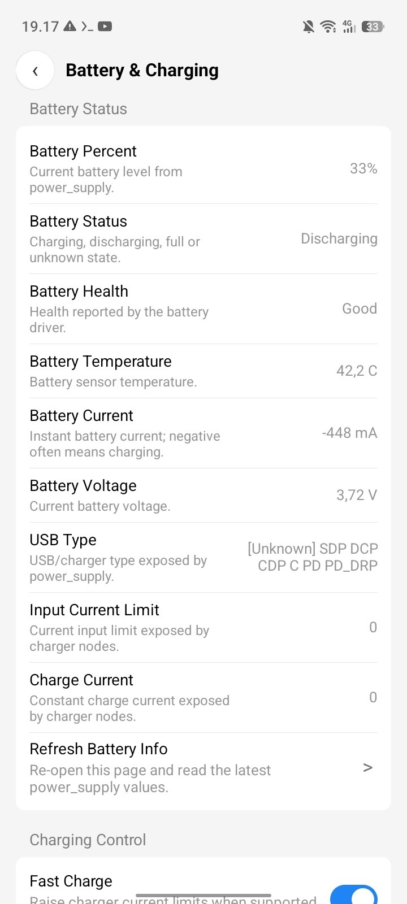
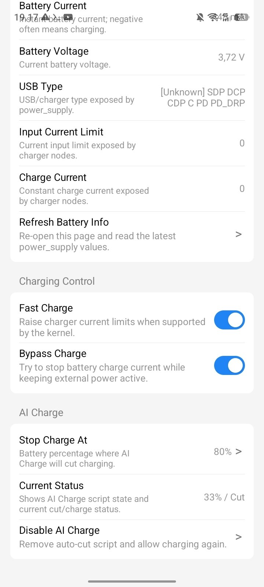
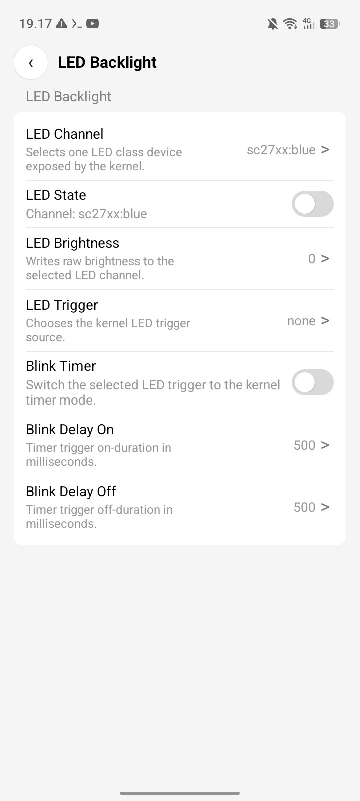
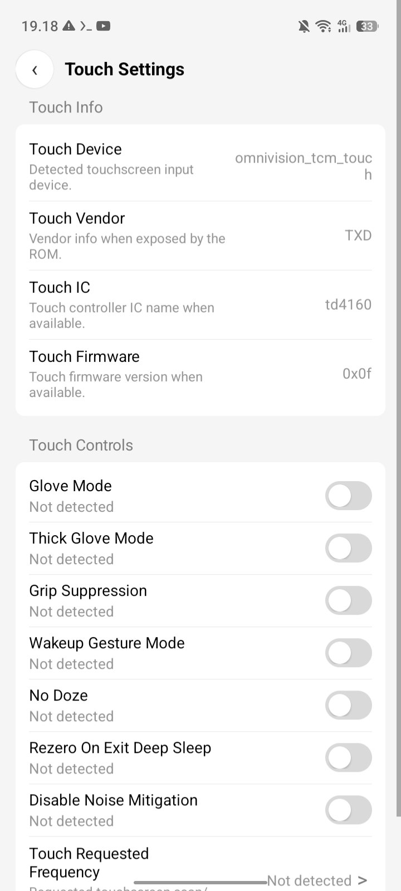
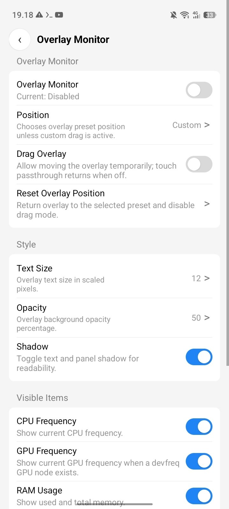
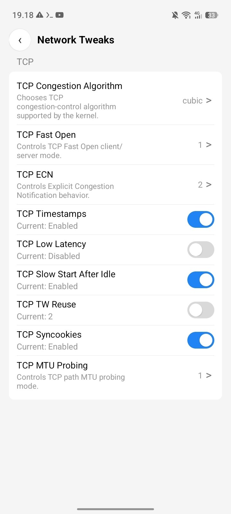

## Install Modes

### ROM or Settings-Patched Install

This build has no launcher icon. It is meant to be opened from a Settings entry or an explicit intent:

```java
Intent intent = new Intent();
intent.setClassName(
    "com.kurumidev.transsionaddons",
    "com.kurumidev.transsionaddons.MainActivity"
);
startActivity(intent);
```

It can also be opened with:

```sh
am start -a com.kurumidev.transsionaddons.OPEN
```

For a ready Settings shortcut patch guide, see [docs/SETTINGS_SHORTCUT_PATCH.md](docs/SETTINGS_SHORTCUT_PATCH.md).

### Root Module Install

For users who do not patch Settings, build or flash the module template in `module/`. The module installs the APK as a system priv-app and includes an `action.sh` button that opens Transsion Addons from compatible module managers.

The app still uses `su` for kernel/sysfs features. Being installed as a priv-app grants Android privileged permissions where supported, but it does not automatically grant Magisk/KernelSU/APatch superuser access. Grant root once when your root manager asks.

## Build

Open the project in Android Studio and build the debug APK, or run:

```sh
gradle assembleDebug
```

To create a flashable system-app module zip:

```sh
./scripts/build-module.sh
```

The output will be written to `dist/TranssionAddons-system-module.zip`.

## Warning

Many controls write directly to kernel nodes or Android system settings. Disabling thermal protection, forcing clocks, or changing charging behavior can cause overheating, instability, data loss, or hardware damage. Use carefully.

## License

This project is licensed under the MIT License. Everyone is free to use, modify, fork, and redistribute it as long as the license notice is kept.
=======
# Transsion-Addons
Transsion Addons Apk

### Screenshots Preview


